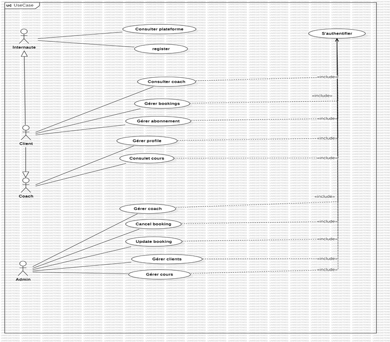
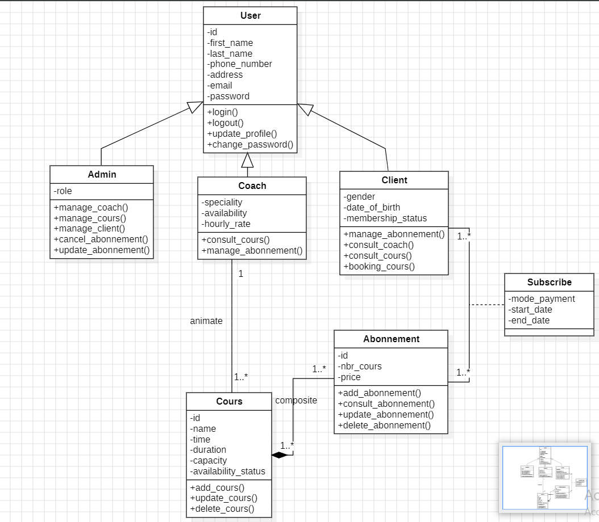

# 🏋️‍♂️ Salle de Sport Management System

This project is a **Spring Boot application** that manages a gym platform, including:

- **User authentication and authorization** (JWT-based)
- **Role-based access** (`Client`, `Coach`, `Admin`)
- **Course and subscription management**
- **Booking workflows**

It provides APIs for clients to register, book classes, and manage their subscriptions, while admins can manage users, coaches, and courses.

---

## 📌 Features

✅ Client registration and login  
✅ Admin creation of coaches and other admins  
✅ Role-based permissions and data filtering  
✅ Subscription and course management  
✅ Secure authentication with JWT  
✅ Dynamic user types (Client, Coach, Admin)

---

## ⚙️ Technologies

- **Java 23**
- **Spring Boot**
- **Spring Security + JWT**
- **Hibernate (JPA)**
- **MySQL**
- **Maven**

---

## 🔐 Default SuperAdmin

When the application starts for the first time, it automatically creates a **SuperAdmin**:

- **Email:** `superadmin@superadmin.com`
- **Password:** `superadmin123`

This account can:
- Create other admins
- Create coaches
- Manage clients
- Manage courses

---

## 🧩 Use Case Diagram

Below is the use case diagram describing the main interactions:

---

## 🧩 Class Diagram

Below is the class diagram illustrating the structure and relationships:
~~~~

---

## 🧭 API Overview

| Endpoint             | Method | Description                    |
|----------------------|--------|--------------------------------|
| `/api/auth/signup`   | POST   | Register new client            |
| `/api/auth/signin`   | POST   | Authenticate user              |
| `/api/auth/signout`  | POST   | Logout user                    |
| `/api/admin/...`     |        | Admin management operations    |
| `/api/coach/...`     |        | Coach management operations    |
| `/api/client/...`    |        | Client-specific operations     |

> **Note:**
> Only **Clients** can register themselves.  
> **Admins** and **Coaches** must be created by an Admin.

---

## ✨ Role-based Behavior

### 👤 Client
- Can register directly
- Can book courses and manage subscriptions
- Can view coaches and courses

---

### 🧑‍🏫 Coach
- Created by Admin
- Manages their courses and schedules

---

### 🛡️ Admin
- Can manage all users
- Can manage courses and bookings

